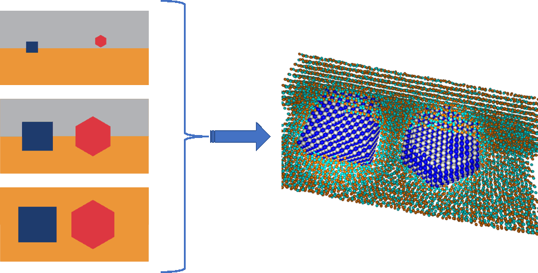

# michaelangelo
A Java package to create complex polycrystalline structures. 

Michaelangelo takes a series of bitmaps, and associates each color in the bitmaps to a crystal structure. Interprets each bitmap as a slice of a polycristalline volume. And produces a list of atomic positions consistent with the crystal strcutures of each grain. These positions can then be used to render a 3D view of the structure (e.g., with [POV-Ray](http://www.povray.org)), or perform atomic calculations. 

You can find an example of structures generated with it in figure 5 of https://doi.org/10.1103/PhysRevB.75.155437

# Usage
src/michaelangelo_eng/Michaelangelo.java defines the Michaelangelo class, which processes the input. The construction takes either an XML object (org.jdom.Element) or the path/name to an XML file. 

After processing the input file, a call to Michaelangelo.getAtomList() returns a src/michaelangelo_eng/AtomList.java object. The calculated atomic positions can be exported with any of the following AtomList methods:
* toXMLfile(fnameout)
* toXYZ(fnameout)
* toPOVRay(fnameout)

where fnameout is the path/name of the desired output file.

Michaelangelo.main() and the main() method of src/michaelangelo_eng/Main.java provide an alternative way to run the workflow. Each takes four string parameters: path_input, filename_input, path_output, filename_output. They use these parmaters to construct the input and output file path/name's, construct a Michaelangelo object, get an AtomList instance from it, and call the ouput exporting method(s).

## Input

The fromat of the XML input files is defined in examples/XML_in/request.dtd. See, for example, examples/XML_in/TiSiN_3L.xml The main elements of the XML request structure are:

### *meta*
Includes a series of elements to describe the final structure and the input bitmaps; including:
* *meta.strcuture.unit* The unit of measure; e.g., pm, fm.
* *meta.structure.bounding-box* The size of the volume to be filled with atoms.
* *meta.bitmap-description.pixel-geometry* Sets the width and heigth of the bitmaps in pixels. These values are used to read the pixel colors from the bitmaps.
* *meta.bitmap-description.colors* Contains a list of color elements, each specifying an id (label) and hex rgb value. The labels are used in the bindings element to associate colors with crystal structures (see below).

### *bitmap*
Contains a series of file elements specifying the color maps describing the polycristalline volume to be created. Each file element has the following attributes:
* id
* path
* name
* type "GIF" or "BMP"
* slice-height The height of the slice to be filed by the bitmap, in units specified by meta.strcuture.unit 
  
### *materials*
Contains a series of *material* elements, specifying the crystal structures to be used to fill the output volume. Each *material* has the following children elements:
* *description* Sets the following attributes:
  * id
  * is-alloy Boolean. If false, atoms at each position are uniquely determined by the crystal strcuture. If true, the crystal structures determines the probability that an atom in a given position is of a certain kind.
  * is-glass Boolean. If true, the position of each atom will be perturbed by a gaussian noise to approximate a non-crystalline material.
  * alpha The standard deviation of the gaussian perturbation to the atomic positions.
 * *origin* The (absolute) position (x, y, z) of the origin of the crystal structure within the target volume. This is used to enable relative displacements between crystal structures.
 * *unit-cell* Contains three *vector* elements defining the primitive vectors of the crystal's [Bravais lattice](https://en.wikipedia.org/wiki/Bravais_lattice)
 * *basis-atoms* Contains a series of *atom* children elements, defining the [basis atoms](https://people.seas.harvard.edu/~jones/ap216/lectures/ls_2/ls2_u7/sse_tut_1/solid1.html) of the crystal structure. Each *atom* has the following children:
  * *relative-coordinates* Fractional coordinates of the basis atom
  * *element-descriptor* Sets the attributes
    * id Used to name the PutAtom macros for POV-Ray scenes.
    * type Chemical symbol of the element.
    * radius Not used
    * probability Used if is-alloy, the probability that the atom at this position is of the specified type. Probabilities add up to 1000. If the total probability for an atomic position (several atoms at the same position) is less than 1000, the difference is the probability of getting a vacancy (no atom) at the position.
  
### *bindings*
A series of *material* elements associating colors in the bitmaps to crystal strcutures, by specifying the attributes:
* color The *meta.bitmap-description.colors.color.id*
* material The *materials.material.id*

## Output

* **AtomList.toXMLfile(fnameout)** and XML file listing the type (element symbol) and position of each atom
* **AtomList.toXYZ(fnameout)** an xyz file listing the type and position of each atom
* **AtomList.toPOVRay(fnameout)** a file to #include in a POV-Ray scene, containing a list of PutAtom_xx_yy(x, y, z) macro calls, derived from calculated atom types and positions. Defining these macros in the POV-Ray scene allows the user to control how the amos will be rendered in the final POV-Ray image.

## Examples
You can find examples of input XML files and corresponding outputs in examples/XML_in and examples/XML_out, respectively. 
